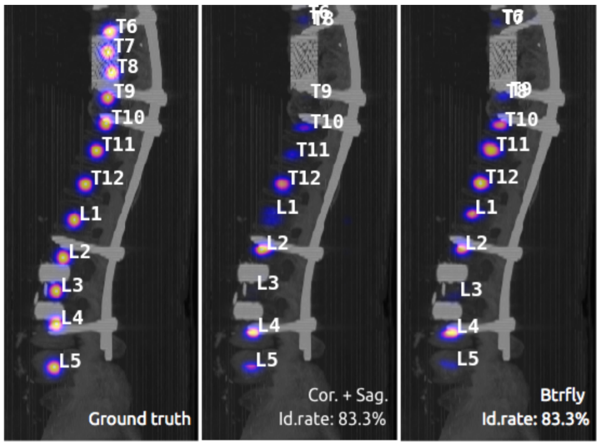

# Btrfly-Net-Pytorch
This repository implements Butterfly Net (for vertebra localization) in PyTorch 1.0 or higher.

Paper: [Sekuboyina A, et al.: Btrfly Net: Vertebrae Labelling with Energy-based Adversarial Learning of Local Spine Prior. In: MICCAI. (2018) ](https://arxiv.org/abs/1804.01307v2)



## Highlights

- **Error Correction**: In view of some mistakes related to the structure of Btrfly Net in the original paper (Sekuboyina A, et al.), we correct the Figure 2 in the paper and build the right structure through PyTorch after contacting with the author many times. 
- **Method Improvement**: We create a new position-inferencing method in order to promote the performance of the model. Now you can see two different kinds of id rate results (using the paper's method and the method we proposed) during training. *Roughly speaking, we use the weighted average of the positions inferenced from the two 2D heat maps instead of the direct outer product of them to get the final positions of vertebrae. This helps promote the id rate by nearly 5% in our experiment.*
- **Configs**: We use [YACS](https://pypi.org/project/yacs/) to manage the parameters, including the devices, hyperparameters of the model and some directory paths. See configs/btrfly.yaml. You can change them freely.
- **Smooth and Enjoyable Training Procedure**: We save the state of model, optimizer, scheduler, training iter, you can stop your training and resume training exactly from the save point without change your training `CMD`.
- **TensorboardX**: We support tensorboardX and the log directory is outputs/tf_logs. If you don't want to use it, just set the parameter `--use_tensorboard` to `0`, according to the "Train Using Your Parameters" section.
- **Evaluating during training**: Evaluate you model every `eval_step` to check performance improving or not.

## Dataset

See [Verse2019 challenge](https://verse2019.grand-challenge.org/Data/) for more information.

The original data directory should be like the following structure.

```
OriginalPath
|__ raw
    |_ 001.nii
    |_ 002.nii
    |_ ...
|__ seg
    |_ 001_seg.nii
    |_ 002_seg.nii
    |_ ...
|__ pos
    |_ 001_ctd.json
    |_ 002_ctd.json
    |_ ...
```

- The dataset has three files corresponding to one data sample, structured as follows:
- - 1. verse.nii.gz - Image
    2. verse_seg.nii.gz - Segmentation Mask
    3. verse_ctd.json - Centroid annotations
    4. verse_snapshot - A PNG overview of the annotations.

- The images need NOT be in the same orientation. Their spacing need NOT be the same. However, an image and its corresponding mask will be in the same orientation.

- Both masks and centroids are linked with the label values [1-24] corresponding to the vertebrae [C1-L5]. Some cases might contain 25, the label L6. 
- The centroid annotations are with respect to the coordinate axis fixed on an isotropic scan (1mm) and a (P, I, R) or (A, S, L) orientation, described as:
- - 1. Origin at Superior (S) - Right (R) - Anterior (A)
    2. 'X' corresponds to S -> I direction
    3. 'Y' corresponds to A -> P direction
    4. 'Z' corresponds to R -> L direction
    5. 'label' corresponds to the vertebral label

## Training

### Train Directly

```python
python train.py 
```

### Train Using Your Parameters

For example, you can change the `save_step` by

```
python train.py --save_step 10
```

See more changeable parameters in train.py file.

## Result

The prediction result will be saved as a `.pth` file in the `pred_list` directory. You can set the parameter `is_test` in test.py to 0 or 1 to determine if the trained model is used for validation set or test set.

